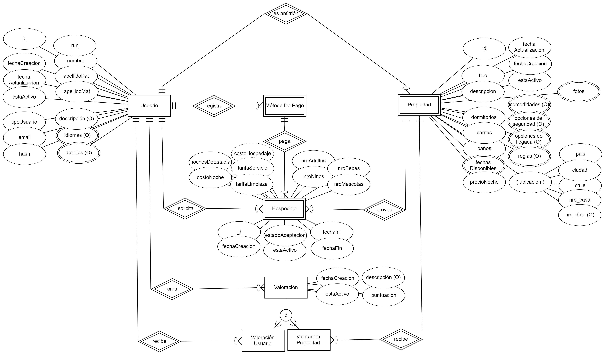

# Airbnb-UTA

Airbnb-UTA es una aplicación que busca replicar las funciones de la plataforma Airbnb con el objetivo de aprender sobre funciones específicas en ambientes externos.

Se incluyen funciones de la plataforma original tanto como funciones propias desarrolladas por el equipo contribuyente al proyecto.

## Contenidos

- [Airbnb-UTA](#airbnb-uta)
  - [Contenidos](#contenidos)
  - [Objetivos del proyecto](#objetivos-del-proyecto)
    - [Objetivos específicos](#objetivos-específicos)
  - [Prioridades del desarrollo](#prioridades-del-desarrollo)
  - [Funciones actuales](#funciones-actuales)
  - [Instalación](#instalación)
  - [Modelo de la base de datos](#modelo-de-la-base-de-datos)

## Objetivos del proyecto

El proyecto tiene como objetivo investigar e integrar funcionalidades y técnicas de desarrollo que pueden hallarse en entornos de producción reales. En este caso específico se tiene como referencia a la mundialmente conocida y exitosa plataforma de Airbnb.

### Objetivos específicos

- Investigar técnicas de desarrollo actuales y compararlas
- Investigar acerca del versionado de código y trabajo colaborativo sobre bases de código y desarrollo de software
- Replicar el proceso el cual una empresa real pueda tener al desarrollar una solución informática, en este caso, sobre el problema que soluciona Airbnb
- Identificar aspectos y puntos claves del desarrollo de la aplicación para su posterior análisis y organización para su ejecución
- Identificar riesgos y decisiones de diseño que puedan afectar al desarrollo de una solución informática, considerando perspectivas como las de un cliente que recibe la solución como las de otros expertos que se manejan en el proceso
- Aplicar y testear las consideraciones recibidas además de intentar incluir innovación propia durante el desarrollo del software

## Prioridades del desarrollo

El proyecto tiene como principal prioridad replicar el flujo de uso de la plataforma Airbnb. Luego, integrar funcionalidades específicas de calidad de servicio, además de otras experimentales que aporten valor a la solución

> [!NOTE]
> Las prioridades del proyecto irán evolucionando a medida que se van descubriendo nuevas técnicas y decisiones de diseño que influyan sustancialmente en su realización

## Funciones actuales

Algunas de las funciones de la versión actual del proyecto (`1.0.0`) incluyen:

1. Registro y Autenticación de usuarios
2. Búsqueda y Filtro de propiedades para arrendar
3. Solicitud de Arriendo de propiedades
4. Registro de métodos de pago
5. Gestión de Solicitudes de Arriendo como anfitrión
6. Resúmenes de valoraciones para propiedades y usuarios
7. Resúmenes financieros de todos los hospedajes en curso
8. Gestión de propiedades creadas

## Instalación

Para que el proyecto funcione correctamente, debe asegurarse de tener instalado [node.js](https://nodejs.org/en) y [Docker Engine](https://docs.docker.com/engine/install/)

1. Para instalar la aplicación, primero debe clonar el repositorio:

```bash
git clone https://github.com/Drzwy/AirBnb-UTA.git
```

2. Luego, instalar las dependencias dentro del submódulo de frontend y backend:

```bash
cd AirBnb-UTA/
cd frontend/ && npm i && cd .. && cd backend/ && npm i && cd ..
```

3. Finalmente, corra los proyectos individualmente:

```bash
cd backend/ && npm run start && npm run db:dev:up && cd ..
cd frontend/ && npm run start && cd ..
```

4. Para acceder a la aplicación utilice la dirección local:

```
http:/localhost:3000/
```

## Modelo de la base de datos


